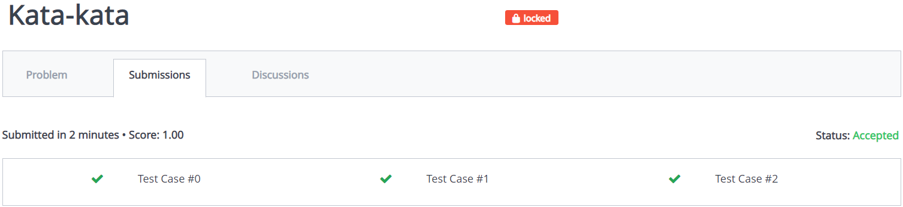
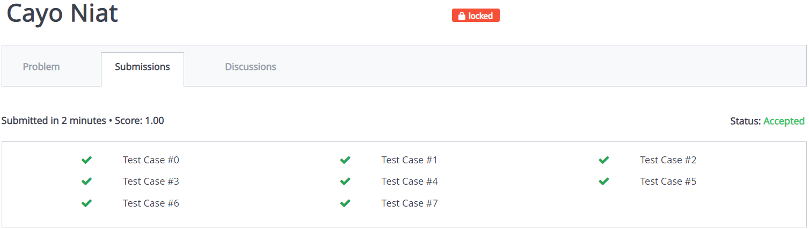
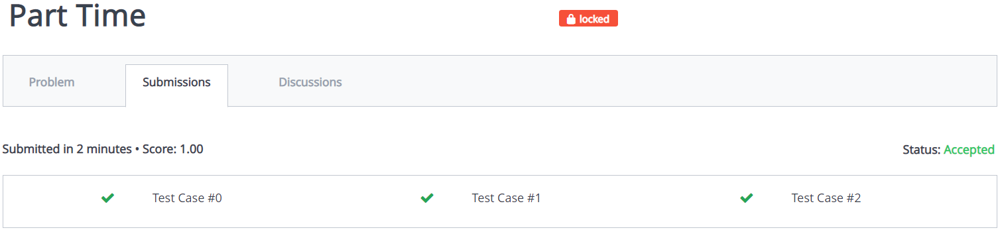
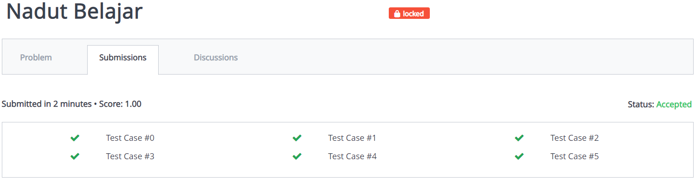

# struktur-data-h-praktikum-3-2021
## Kata-kata
### Verdict
AC Perbaikan
### Bukti

### Penjelasan Soal
Diberikan n kata yang disimpan [a-z]. Untuk setiap q, cari apakah kata tersimpan (output 1) atau tidak (output 0).
### Penjelasan Solusi
Tree akan menyimpan data string, lalu program akan menggunakan bool untuk mengecek apakah sudah mencapai akhir kata atau belum, program akan melakukan search sesuai string yang dimasukkan, ketika ada kata yang sesuai maka output keluar angka 1 sesuai dengan urutan kata, ketika tidak ada maka keluar 0
## Cayo Niat
### Verdict
AC Perbaikan
### Bukti

### Penjelasan Soal
Diberikan kata-kata yang dipisah oleh whitespace, program diminta mengeluarkan output terurut secara abjad: pertama, dengan format penomoran (mulai 1.) perbaris, kedua, dipisah oleh "--<3--" dalam satu baris
### Penjelasan Solusi
Setiap kata akan dimasukkan ke dalam tree. Lalu dioutputkan sesuai secara abjad, yang diurutkan sesuai dengan instruksi yang diberikan
## Part Time
### Verdict
AC Perbaikan
### Bukti

### Penjelasan Soal
Diberikan data indeks M barang P dan harganya Q, serta N query transaksi berisi jumlah pembelian X dan id Y. Program diminta mengeluarkan total pendapatan, Maaf barang tidak tersedia jika barang tidak ditemukan, dan jika input id tidak urut keluarkan ID harus urut dan akhiri program.
### Penjelasan Solusi
Program menyimpan data barang menggunakan array. Pertama, program menyimpan M dan N, kemudian menyimpan data. Setelah menyimpan data program mengecek, bila input id tidak urut dari input sebelumnya, keluarkan Sample Input 1,
## Nadut Belajar
### Verdict
AC Perbaikan
### Bukti

### Penjelasan Soal
Program diminta menghitung selisih parent node dengan siblingnya
### Penjelasan Solusi
Program menggunakan Tree untuk nanti nya dicek menggunakan fungsi, pertama fungsi mengecek apabila memiliki parent atau tidak, jika tidak keluar 0. Lalu dicek lagi jika parent node juga punya parent, jika tidak maka keluarkan nilai node itu. Terakhir program mengecek jika parent node memiliki sibling, maka program akan menghitung perbedaan mutlak
